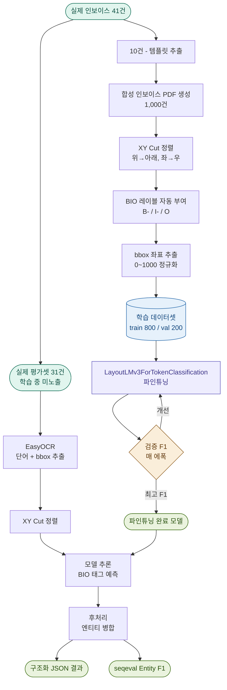
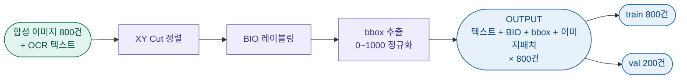
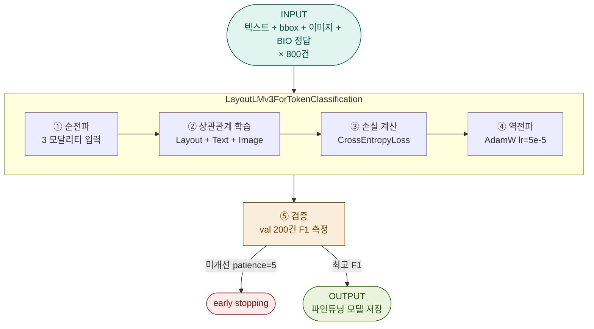
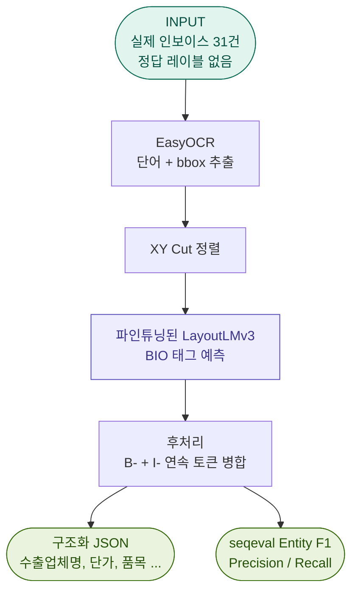
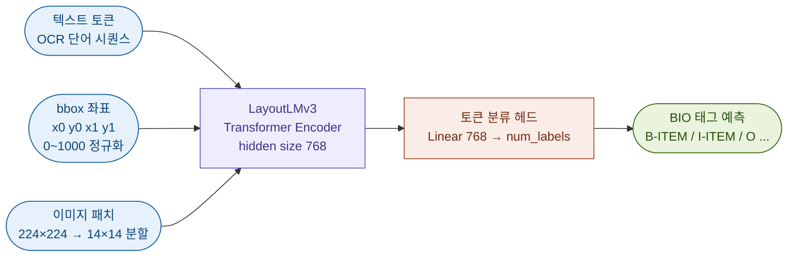

  ## 배경 및 문제

  해외 수산물 무역 인보이스는 수출국·업체마다 레이아웃이 제각각입니다.  
  동일한 필드(단가, 수량, 금액 등)라도 표의 위치나 헤더 표기 방식이 문서마다 달라 규칙 기반 자동화가 어렵습니다.

  이를 해결하려고 LLM(GPT 등)을 활용했으나 다음 문제가 반복되었습니다:

  | 문제 | 설명 |
  |------|------|
  | **수치 환각** | 단가·금액·중량 등 숫자 필드에서 실제 문서에 없는 값을 출력 |
  | **품목 누락** | 라인 아이템이 여러 개일 때 일부 품목을 빠뜨리는 경우 발생 |
  | **느린 처리** | API 호출 기반이라 대량 처리 시 비용·속도 문제 |

  파인튜닝된 전용 모델이 대안이지만, **학습에 필요한 레이블 데이터를 구하기 어렵습니다.**  
  실제 인보이스는 거래처 정보·가격 등 민감한 정보를 담고 있어 대량 수집과 레이블링이 쉽지 않습니다.

  **제안**: 실제 인보이스 레이아웃을 템플릿으로 삼아 합성 PDF를 생성해 학습 데이터를 확보하고, LayoutLMv3를 파인튜닝합니다.  

  ---

  ## 이전 연구와의 비교

  | 구분 | 이전 연구 (Schema-based) | 현재 연구 (Layout Fine-tuning) |
  |------|--------------------------|-------------------------------|
  | 핵심 접근법 | 고정된 규칙 및 스키마 정의 | 데이터 기반 레이아웃 특징 학습 |
  | 유연성 | 새로운 양식 출현 시 스키마 재설계 필요 | 미학습 양식에도 일반화된 추출 가능 |
  | 학습 방식 | 텍스트 위치 및 필드 매핑 중심 | 시각적 요소(Line, Box)와 텍스트의 상관관계 학습 |
  | 평가 초점 | 정의된 필드의 정확도 | 복잡한 인보이스 구조 분석 및 영역 추출 성능 |

  ---

  ## 방법론 (LayoutLMv3)

  ### 모델 선택 근거

  1. 검증된 성능: Huang et al.(2022)은 LayoutLMv3를 통해 FUNSD 및 CORD와 같은 주요 문서 이해 벤치마크에서 SOTA(최고 성능)를 달성하였습니다. 
  2. 멀티모달 학습: 텍스트(Text), 위치(Layout), 이미지(Vision) 정보를 단일 모델 내에서 통합하여 학습하므로, 인보이스처럼 구조가 복잡한 문서 분석에 최적화되어 있습니다.

  **LayoutLMv3 입력 구성:**

  | 입력 | 설명 |
  |------|------|
  | 단어(Token) | OCR 또는 텍스트 레이어에서 추출한 단어 시퀀스 |
  | 위치(Bbox) | 각 단어의 페이지 내 좌표 — `[x0, y0, x1, y1]` (0–1000 정규화) |
  | 이미지(Patch) | 문서 페이지를 224×224로 리사이즈한 후 14×14 패치로 분할한 시각 정보 |

  세 가지 정보를 하나의 Transformer에 함께 입력해 텍스트·위치·시각 정보를 동시에 학습합니다.

  ---

  PEneo(2024)는 LayoutLMv3 백본에서 BIO 태깅과 XY Cut 기반 입력 정렬을 결합한 방식이 효과적임을 보였습니다.

  #### 1. XY Cut 기반 입력 정렬

  OCR은 가끔 문서의 글자를 뒤죽박죽으로 읽어 들입니다.  
  예를 들어, 왼쪽·오른쪽 열이 나뉜 문서에서 줄 단위로 쭉 읽어버리면 문맥이 꼬이게 됩니다.

  - **XY Cut이란?** 문서를 가로(X)와 세로(Y)로 나누어 구역을 정하는 기술
  - **위→아래, 좌→우** 사람이 책을 읽는 표준 순서대로 단어를 재정렬
  - **왜 하는가?** 모델이 글자의 선후 관계를 올바르게 파악해야 "인보이스 번호" 옆의 "CHQ24PS01"이 그 번호의 값임을 정확히 학습할 수 있기 때문

  #### 2. BIO 태깅 

  모델은 단순히 텍스트만 보고는 어디서부터 어디까지가 "수출업체 주소"인지 알 수 없습니다.  
  각 단어에 **시작(Begin) / 내부(Inside) / 외부(Outside)** 이름표를 붙여 경계를 알려줍니다.

  | 태그 | 의미 | 예시 |
  |------|------|------|
  | `B-` (Begin) | 해당 필드가 여기서 시작됨 | `B-EXPORTER_NAME` → "PT." |
  | `I-` (Inside) | 앞 단어에 이어지는 내용 | `I-EXPORTER_NAME` → "INDO", "PACIFIC" |
  | `O` (Outside) | 어떤 필드에도 속하지 않는 단어 | 구분선, 헤더 텍스트 등 |

  ```
  단어:   "PT."            "INDO"           "PACIFIC"        "9.76"
  레이블: B-EXPORTER_NAME  I-EXPORTER_NAME  I-EXPORTER_NAME  B-ITEM_UNIT_PRICE
          ↑ 수출업체 시작    ↑ 수출업체 계속   ↑ 수출업체 계속   ↑ 단가 시작
  ```


  #### 3. 왜 이 방식이 효과적인가?

  모델(LayoutLMv3)은 학습할 때 다음 세 가지 상관관계를 동시에 배웁니다.

  1. 순서적 관계 (XY Cut): 인보이스 위쪽에서 'EXPORTER'라는 글자가 나오면, 그 바로 뒤나 아래에 업체 이름을 식별

  2. 영역적 관계 (BIO): 업체 이름은 보통 한 단어가 아니라 3~4개 단어가 연속해서(B-I-I) 나오기 때문에 하나의 정보라는 걸 알 수 있음

  3. 위치적 관계 (LayoutLMv3 특성): 이런 정보들은 주로 종이의 왼쪽 상단 네모칸(bbox) 안에 모여 있구나 라는 것을 알 수 있음

  ---

  ### 학습 하이퍼파라미터

  DocILE(Šimsa et al., 2023)의 학습 설정과 LayoutLMv3 원논문의 권장 설정을 참고

  ```python
  from transformers import TrainingArguments

  args = TrainingArguments(
      num_train_epochs=30,              # 학습 반복 횟수 
      per_device_train_batch_size=4,    # 4개씩 묶어서 학습
      per_device_eval_batch_size=4,    
      learning_rate=5e-5,               # 학습률 (가중치 업데이트 보폭)
      weight_decay=0.01,                # 과적합 방지를 위한 가중치 감쇠
      warmup_ratio=0.1,                 # 전체 스텝의 10%는 학습률을 천천히 올림
      lr_scheduler_type="cosine",       # 학습률 감소 방식 (처음빠르게 뒤로 갈수록 천천히 학습)
      evaluation_strategy="epoch",      # 매 에폭 종료 시 검증 수행
      save_strategy="epoch",            # 매 에폭 종료 시 모델 저장
  )
  ```

  선행 연구의 권장 설정을 초기값으로 채택하고, 이후 검증 손실 기반으로 하이퍼파라미터를 조정할 예정입니다.

  
  ---

  ## 총 파이프라인

# 학습 파이프라인 아키텍처

---

## 전체 흐름



---

## 1단계 — 입력 데이터 준비



---

## 2단계 — 모델 학습



---

## 3단계 — 평가 (추론)



---

## LayoutLMv3 입력 구성



  ```
  ─────────────────────────────────────────────────────────────────
  [데이터 수집]
  ─────────────────────────────────────────────────────────────────

    실제 인보이스 41건 확보
            │
            ├─ 10건 ──► 레이아웃 템플릿
            │
            └─ 31건 ──► 최종 평가셋 (학습 중 미노출)


  ─────────────────────────────────────────────────────────────────
  [① 합성 데이터 생성]
  ─────────────────────────────────────────────────────────────────

    실제 인보이스 10건
            │
            │  ※ 실제 인보이스는 민감 정보(가격·거래처)가 있어
            │    그대로 학습 데이터 X
            │
            ▼ 레이아웃 구조 분석 → 템플릿 제작
    인보이스 템플릿 
            │
            ▼ 템플릿에 가상 데이터 주입 → PDF 대량 생성
    합성 인보이스 PDF 1,000건
    (실제 인보이스 유사한 구조,
     업체명·금액·품목은 모두 가상)
            │
            │  ※ 합성 PDF는 컴퓨터가 직접 만들었기 때문에
            │    각 단어가 페이지 어디에 있는지 확인 가능
            │    → 따로 사람이 위치를 표시할 필요 없음
            │
            ▼ 각 단어의 위치(좌표) 자동 추출
    단어 + 페이지 내 위치 좌표 (ex: "9.6", [504, 214, 545, 220])
            │
            │  ※ 모델이 학습하려면 각 단어가 어떤 필드인지
            │    레이블가 있어야 함 ──► BIO 태깅 
            │    
            │
            ▼ 단어마다 레이블 자동 부여
      "PT."    → 수출업체 시작 B-exporter
      "INDO"   → 수출업체 계속 I-exporter
      "9.76"   → 단가         B-unit_price
      "KGS"    → 중량 단위    B-net-weight
      그 외     → 해당 없음   O
            │
            ▼
    학습용 데이터셋 완성  (train 800건 / val 200건)


  ─────────────────────────────────────────────────────────────────
  [② 모델 학습]
  ─────────────────────────────────────────────────────────────────

    학습용 데이터셋 (800건)
            │
            ▼ LayoutLMv3 파인튜닝
            │  - 합성 800건으로 학습
            │  - 매 에폭 검증 F1 측정
            │  - F1이 가장 높은 시점의 가중치 저장
            │
            ▼
    파인튜닝 완료된 LayoutLMv3


  ─────────────────────────────────────────────────────────────────
  [③ 평가 ] (좀 더 생각해 볼 예정)
  ─────────────────────────────────────────────────────────────────

    실제 인보이스 31건
            │
            ▼ EasyOCR → 단어 + 위치 좌표
            │
      ┌─────┴──────────────────────┐
      ▼                            ▼
    파인튜닝 전                  파인튜닝 후
    (LayoutLMv3 원본)            (합성 데이터로 학습)
      └─────┬──────────────────────┘
            │
            ▼
    ┌─────────────────────────────────────────────────────────┐
    │  평가 지표 1 — 엔티티 F1 (seqeval)                       │
    │  레이블 시작·끝 위치와 필드 종류가 모두 일치해야 정답 인정  │
    │                                                         │
    │  평가 지표 2 — KIE 정확도                                │
    │  모델이 추출한 텍스트 값이 정답값과 정확히 일치하는 비율    │
    └─────────────────────────────────────────────────────────┘
            │
            ▼
    ┌─────────────────────────────────────────────────────────────────────┐
    │  최종 비교                                                           │
    │                                                                     │
    │  항목              파인튜닝 전   파인튜닝 후   선행 연구              │
    │  ─────────────────────────────────────────────────────             │
    │  엔티티 F1          -            -            -                     │
    │  KIE 정확도         -            -            -                     │
    └─────────────────────────────────────────────────────────────────────┘
  ```

---

## 참고 문헌

| 논문 | 활용 근거 |
|------|-----------|
| Huang et al. (2022). *LayoutLMv3: Pre-training for Document AI with Unified Text and Image Masking.* ACM MM | 모델 선택 및 토큰 분류 파인튜닝 방식 근거 |
| Šimsa et al. (2023). *DocILE Benchmark for Document Information Localization and Extraction.* ICDAR | 합성 데이터 전략 및 학습 설정 근거 |
| PEneo (2024). *Unifying Line Extraction, Line Grouping, and Entity Linking.* ACM MM | BIO 태깅 + 입력 정렬 방식 근거 |
| DocExtractNet (2025). *A novel framework for enhanced information extraction from business documents.* ScienceDirect | 인보이스 도메인 파인튜닝 실증 근거 |
